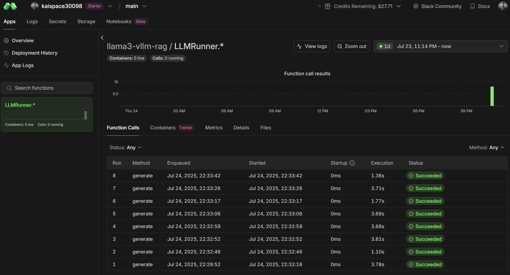

# LLaMA 3 8B QLoRA Fine-tuning and Modal Deployment with vLLM

This repository demonstrates how to **fine-tune the LLaMA 3 8B model using QLoRA** on the combined **Alpaca** and **OpenAssistant** datasets, and deploy the merged LoRA adapter model for **accelerated inference** using **vLLM** on **modal.ai** cloud with A100 GPU.

---

## 🚀 Project Overview

- Fine-tune Meta LLaMA 3 8B with **QLoRA** (quantized LoRA) on a custom QA dataset combining:
  - [Stanford Alpaca](https://github.com/tatsu-lab/stanford_alpaca)
  - [OpenAssistant (OASST1)](https://huggingface.co/datasets/OpenAssistant/oasst1)
- Use AWS S3 for dataset and adapter checkpoint storage.
- Merge LoRA adapter into the base LLaMA 3 8B model.
- Upload merged model to Hugging Face Hub.
- Deploy the merged model on **modal.ai** GPU containers leveraging **vLLM** for fast and memory-efficient inference.
- Provide a lightweight client to interact remotely with the deployed model.
- Prepare for integration as a LangGraph RAG LLM backend.

---

## 🗂 Dataset Preparation

- Download and parse Alpaca and OpenAssistant datasets.
- Combine and split into train/eval sets.
- Upload processed JSONL files to AWS S3 for training.

---

## 🛠 Fine-tuning with QLoRA on Colab (A100 GPU)

- Load LLaMA 3 8B base model with 4-bit quantization using `bitsandbytes`.
- Prepare model with PEFT `LoRA` adapters.
- Train on sampled dataset (e.g. 2000 samples) with HuggingFace `Trainer`.
- Save LoRA adapter checkpoints locally.
- Upload LoRA adapter to AWS S3 for backup and later retrieval.

---

## ⚙️ Merge Adapter and Save Merged Model

- Download LoRA adapter from S3.
- Load base LLaMA 3 8B.
- Merge LoRA adapter weights into base model.
- Save merged model locally.
- Upload merged model folder to Hugging Face Hub for downstream use.

---

## ⚡️ Inference with vLLM on modal.ai

- Define a `modal` app to build a container image with required dependencies (`vllm`, `transformers`, `torch`, `huggingface_hub`).
- Deploy the merged model from HF Hub onto an A100 GPU-enabled modal container.
- Use `vllm.LLM` with `SamplingParams` for fast and cost-efficient text generation.
- Expose a remote `generate` method to run inference with a given prompt.
- Provide local client script to call remote model seamlessly.

---

## 📦 Repository Structure
data
├──convert_oasst_alpaca.py
colab_experiment
├──qlora adaptor training.ipynb
vllm
├──credential.py
├──merge_lora.py
├──upload_merged_model_to_hf.py
├──modal_inference.py
├──client.py
├──adapter
     ├──adapter_config.json
     ├──adapter_model.safetensors

## 🔧 Requirements

- Python 3.8+
- `transformers`, `datasets`, `bitsandbytes`, `peft`, `torch`, `boto3`
- `modal` CLI and account setup with A100 GPU support
- AWS S3 bucket for dataset and adapter storage
- Hugging Face account and access token for model hosting

### Description

- `data/convert_oasst_alpaca.py`: Handles dataset downloading, parsing, and merging of OpenAssistant and Alpaca into training-ready JSONL files.
- `colab_experiment/qlora adaptor training.ipynb`: Colab notebook running QLoRA fine-tuning on LLaMA 3 8B using A100 GPU.
- `vllm/` folder contains all scripts related to model merging, uploading, and inference deployment:
  - `credential.py`: Manages AWS and Hugging Face credentials (recommended to use environment variables or secret managers to keep secrets safe).
  - `merge_lora.py`: Downloads the LoRA adapter checkpoint and merges it into the base LLaMA 3 8B model.
  - `upload_merged_model_to_hf.py`: Uploads the merged full model to Hugging Face Hub for serving.
  - `modal_inference.py`: Defines the Modal application that deploys the merged model with vLLM on an A100 GPU container.
  - `client.py`: A local client example to invoke the remote inference endpoint on Modal.
  - `adapter/`: Stores your local LoRA adapter files (`adapter_config.json` and `adapter_model.safetensors`).

